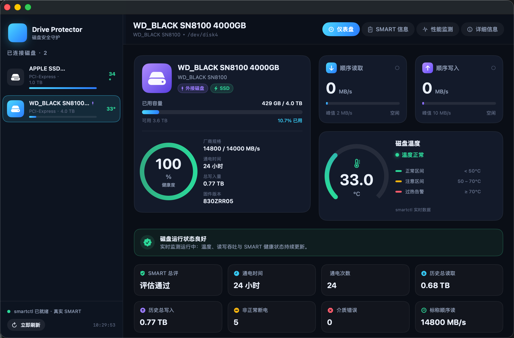
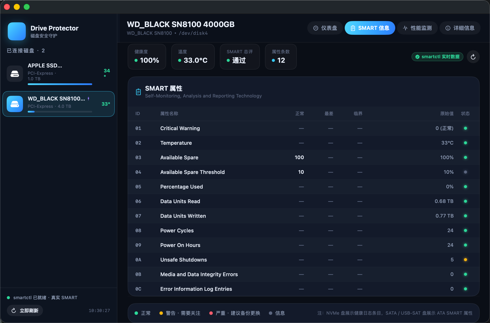
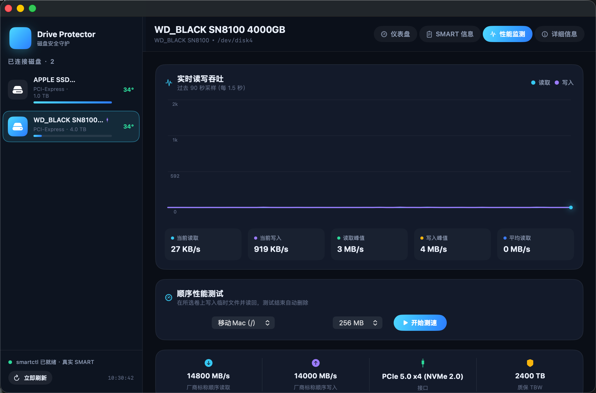
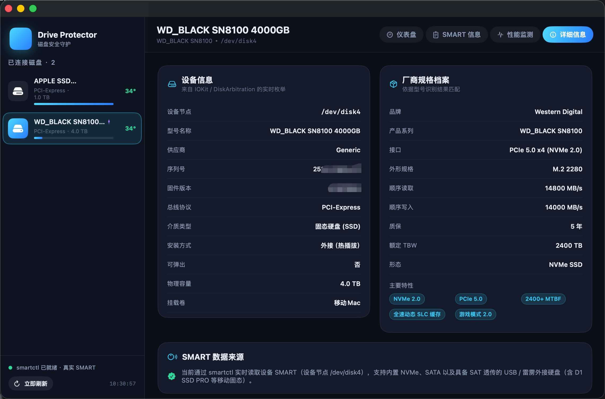

# Drive Protector · 磁盘守护

一款 macOS 原生的磁盘安全守护应用，参考 Samsung Magician 的视觉与信息架构，使用 SwiftUI 构建，支持内置与外接磁盘（含 Thunderbolt 5 / NVMe SSD）的实时温度、读写速度监控以及完整 SMART 健康信息查询。App 内置 `smartctl` 二进制，**开箱即用，无需额外安装命令行工具**。

> 已通过 Apple Developer ID 签名 + 公证（Notarization），可直接分享给其他 macOS 13.0+ 用户使用，Gatekeeper 不会拦截。


---

## 目录

- [功能亮点](#功能亮点)
- [截图预览](#截图预览)
- [下载与安装](#下载与安装)
- [使用方法](#使用方法)
- [菜单栏挂件](#菜单栏挂件)
- [从源码构建](#从源码构建)
- [常见问题](#常见问题)
- [技术架构](#技术架构)

---

## 功能亮点

- **全磁盘枚举**：内置 / 外接磁盘统一展示，递归遍历 IO 服务树，可靠发现 Thunderbolt 5、USB、NVMe 等各类设备。
- **实时吞吐监控**：读取 / 写入速度按 1Hz 频率刷新，自动折算成 KB/s · MB/s · GB/s，并记录峰值。
- **温度与告警**：单盘温度实时显示，菜单栏图标显示最热磁盘温度，≥55°C 橙色、≥70°C 红色高亮。
- **完整 SMART**：健康度百分比、通电时长、通电次数、不安全关机次数、介质错误、TBW 写入量、各属性表。
- **性能测速**：内置顺序读写基准测试，方便快速验证磁盘是否达到标称性能。
- **磁盘画像库**：内置 Samsung 990 Pro、WD SN8100、SN850X 等型号的标称参数（最大读写、TBW），用于实时对比。
- **菜单栏挂件**：常驻菜单栏，无需打开主窗口即可查看所有挂载磁盘温度与读写速度。
- **暗色主题**：参考 Samsung Magician 风格的深色 UI，信息密度高、读数清晰。

---

## 截图预览

> 截图存放在 [`screenshots/`](./screenshots) 目录，启动 App 后可使用 `Cmd + Shift + 5` 自行抓取。

| 仪表盘 | SMART 信息 | 性能监测 | 菜单栏挂件 |
|--------|-----------|----------|------------|
|  |  |  |  |

**主界面布局**：

- 左侧边栏：磁盘列表（型号、容量、接口、占用率、温度），按内置 / 外接自动区分图标与配色。
- 顶部 Tab：仪表盘 / SMART 信息 / 性能监测 / 详细信息。
- 仪表盘：磁盘主卡（健康度环形进度）、顺序读 / 写速度卡（带峰值与标称对比）、温度卡。
- SMART 信息：健康度总览 + 完整属性表（ID / 名称 / 当前值 / 最差值 / 阈值 / 原始值 / 状态）。
- 性能监测：实时读写曲线图 + 测速按钮。
- 详细信息：序列号、固件版本、PCIe Lanes、TBW 已写入 / 额定寿命等。

---

## 下载与安装

### 方式一：下载已公证的发布包（推荐）

1. 前往项目的 [Releases](../../releases) 页面，下载最新的 `Drive.Protector-x.x.x.zip`。
2. 解压后，将 `Drive Protector.app` 拖入「应用程序」文件夹。
3. 首次启动时，若 Gatekeeper 提示无法验证开发者：
   - 点击「取消」；
   - 进入「系统设置 → 隐私与安全性」，找到「已阻止使用 Drive Protector」提示，点击「仍要打开」。
   - 由于应用已通过 Apple 公证，通常不会出现该提示。

### 方式二：直接使用 dist 目录下的产物

仓库根目录 `dist/Drive Protector.app` 已完成 Developer ID 签名 + 公证，可直接双击运行，或拷贝到任意 macOS 13.0+ 机器使用。

校验签名与公证状态：

```bash
# 检查代码签名
codesign -dv --verbose=4 "/Applications/Drive Protector.app"

# 检查公证票据
xcrun stapler validate "/Applications/Drive Protector.app"
```

预期输出应包含 `Authority=Developer ID Application: ...` 与 `Tickets are present`。

---

## 使用方法

1. **启动应用**：双击 `Drive Protector.app`，主窗口自动弹出。
2. **选择磁盘**：在左侧边栏点击任意磁盘，右侧切换对应数据。
3. **查看 SMART**：点击顶部「SMART 信息」Tab，展示当前盘的完整 SMART 属性表。
4. **性能监测**：点击「性能监测」Tab 查看实时读写曲线；点击「开始测速」运行顺序读写基准。
5. **手动刷新**：左下角「立即刷新」按钮可重新拉取 SMART 与吞吐数据。
6. **菜单栏挂件**：关闭主窗口后，菜单栏图标仍实时显示最热磁盘温度，点击展开下拉面板查看各盘详情，点击「打开主窗口」恢复主界面。

### 命令行诊断模式

App 内置一个磁盘枚举诊断命令，方便排查磁盘未被识别的问题：

```bash
"/Applications/Drive Protector.app/Contents/MacOS/DriveProtector" --dump-disks
```

输出示例：

```
共检测到 5 块物理磁盘
— disk0 | APPLE SSD ... | PCI-Express | 1.0 TB | 外接:false SSD:true | 计数器 R:... W:...
    · Macintosh HD @ /  ...
— disk5 | WD ... SN8100 4T | Thunderbolt | 4.0 TB | 外接:true SSD:true | ...
smartctl: /Applications/Drive Protector.app/Contents/Resources/bin/smartctl
smartctl 来源: App 内置（开箱即用）
```

---

## 菜单栏挂件

菜单栏挂件常驻于系统菜单栏：

- **图标**：硬盘图标 + 当前最热磁盘的温度数值。
- **配色规则**：
  - 默认：< 55°C，白色；
  - 橙色：55 °C ≤ T < 70 °C；
  - 红色：T ≥ 70 °C。
- **下拉面板**：列出每块挂载磁盘的名称、容量、温度、读 / 写速度，底部提供「打开主窗口」按钮。
- **数据共享**：挂件与主窗口共享同一 `MonitorStore`，数据完全同步。

---

## 从源码构建

### 依赖

- macOS 13.0+
- Xcode 15+ / Swift 5.9+
- Homebrew（可选，用于安装 `smartmontools` 以打包内置 `smartctl`）

### 步骤

```bash
# 1. 克隆仓库
git clone <repo-url>
cd drive-protector

# 2. （可选）安装 smartmontools，使打包脚本可嵌入 smartctl
brew install smartmontools

# 3. 打包为 .app（含 ad-hoc 签名，仅本机使用）
./scripts/make-app.sh

# 产物：dist/Drive Protector.app
```

### Developer ID 签名 + 公证（用于分发）

```bash
./scripts/notarize.sh \
    --identity "Developer ID Application: Your Name (TEAMID)" \
    --apple-id "you@example.com" \
    --team-id "TEAMID" \
    --app-specific-password "xxxx-xxxx-xxxx-xxxx"
```

脚本会自动完成：
1. 签名 App Bundle 与内嵌的 `smartctl` 二进制；
2. 压缩为 `dist/DriveProtector-notary.zip`；
3. 提交 Apple 公证并等待结果；
4. 将公证票据 staple 回 App Bundle。

> App-specific Password 需在 <https://appleid.apple.com> → 「App 专用密码」生成。

---

## 常见问题

### Q1：外接硬盘（Thunderbolt NVMe）未被识别？

App 已使用递归遍历 IO 服务树的方式枚举磁盘，可兼容 Thunderbolt 5 等外接 NVMe 盘。若仍未识别，请先运行：

```bash
"/Applications/Drive Protector.app/Contents/MacOS/DriveProtector" --dump-disks
```

查看底层枚举结果，若列表为空，可能是该磁盘未挂载或被 macOS 识别为非块设备。

### Q2：SMART 数据为「演示模式」？

表示 App 未找到内置或系统的 `smartctl`。请：
- 重新执行 `./scripts/make-app.sh`，并确认 `brew install smartmontools` 已安装；
- 或直接安装本仓库 Releases 页面中已公证的发布包（已内置 `smartctl`）。

### Q3：需要 root 权限吗？

读取 SMART 数据需要访问 `/dev/disk*`，首次执行时 macOS 会提示授权（或要求以管理员权限运行）。读取挂载卷信息与吞吐量统计无需提权。

### Q4：能在 Mac App Store 上架吗？

App 使用了 IOKit 直接访问磁盘设备并执行内置 `smartctl`，不符合 Mac App Store 沙盒规则，仅适合通过 Developer ID + 公证的方式分发。

---

## 技术架构

- **UI**：SwiftUI + AppKit（`MenuBarExtra`），暗色主题统一。
- **磁盘枚举**：IOKit 递归遍历 IO 服务树（避免 `IOServiceMatching("IOMedia")` 在外接 NVMe 盘上失败的问题）。
- **SMART 数据源**：优先 App Bundle `Contents/Resources/bin/smartctl` → 系统路径 `/opt/homebrew/sbin/smartctl` 等 → 演示数据回退。
- **数据流**：`MonitorStore` 作为 `@StateObject` 在 `App` 根注入，主窗口与菜单栏挂件通过 `@EnvironmentObject` 共享，保证数据同步。
- **签名**：Hardened Runtime + `com.apple.security.cs.disable-library-validation`（允许加载内置未签名 `smartctl`）。

---

## License

MIT License. 内置的 `smartmontools` 遵循其原始许可证（GPL），以独立二进制形式分发。
